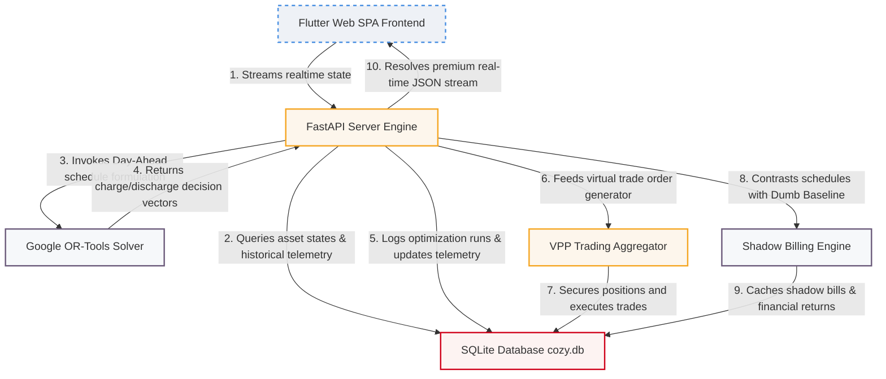

<div align="center">

# 🏠 Cozy ⚡️
### **The State-of-the-Art Home Energy Management System (HEMS) App Prototype**

*Maximize savings, automate dynamic charging cycles, participate in Virtual Power Plants (VPP), and visualize real-time energy dispatches.*

<p align="center">
  
  
  
  
  
  
</p>

---
</div>

Cozy is a premium, high-fidelity Home Energy Management System (HEMS) prototype designed to optimize battery dispatches, schedule Electric Vehicle charging sessions, and maximize financial savings. Cozy leverages linear programming to solve complex cost-minimization equations in real time based on dynamic grid day-ahead pricing and active home energy profiles.

Beyond typical dashboard visualization, Cozy implements:
*   **Linear Programming Solver**: Powered by Google OR-Tools to compute optimal schedules.
*   **Virtual Power Plant (VPP) Integration**: An aggregation and algorithmic trading simulator for grid export trading.
*   **Physics Simulation Layer**: Realistic telemetry modeling (SoC dynamics, charging efficiency losses, and discrete step integrations).
*   **Multi-Tenant Shadow Billing**: Dynamic calculation comparing active HEMS schedules against traditional "dumb" control baselines.

---

## 🗺️ Table of Contents
- [🔬 System Architecture](#-system-architecture)
- [✨ Core Features](#-core-features)
- [📂 Project Structure](#-project-structure)
- [🧠 Optimization Engine (Linear Programming)](#-optimization-engine-linear-programming)
- [🔌 REST API Documentation](#-rest-api-documentation)
- [🧪 Automated Verification Suite](#-automated-verification-suite)
- [📸 High-Fidelity Showcases](#-high-fidelity-showcases)
- [🚀 Quickstart & Setup Guide](#-quickstart--setup-guide)
- [🛡️ License](#-license)

---

## 🔬 System Architecture

Cozy is built on a closed-loop micro-architecture, coordinating asynchronous client actions, database persistent states, optimization heuristics, and simulated smart-grid feedback.



---

## ✨ Core Features

*   🏡 **Live Energy Flow Visualizer**: An animated, responsive isometric villa view representing real-time dispatches (Solar PV generation, Home load draw, Battery SoC status, Tesla charger draw, and Grid import/export) based on SQLite seed data.
*   📈 **Dual-Axis Optimization Horizon**: A premium dual-axis bar and line chart visually tracking Solar curves, Battery dispatches, EV charging profiles, Net grid feed-ins, and Day-Ahead electricity pricing simultaneously.
*   💰 **Real-Time Financial Analytics**: Interactive reports contrasting your active cost (€) against a traditional "dumb" benchmark (no battery, non-optimized charging) over 48-hour and monthly scales.
*   ⚙️ **Asset Preference Modals**: Save target State of Charge (SoC) rules for your Home Battery or Electric Vehicle, immediately writing parameters back to the FastAPI database layer.
*   ⚡ **Virtual Power Plant (VPP) Aggregator**: An integrated aggregator and trader service that monitors forecasted surplus battery dispatches and generates trade order positions for wholesale grid trading.
*   🛡️ **Smart Forecasting Fallback**: A built-in resilient scheduling algorithm that seamlessly takes over if heavy external deep learning models (NeuralForecast/TiDE) are missing, ensuring 100% server uptime.

---

## 📂 Project Structure

```
cozy/
├── app/                          # Flutter Web SPA Frontend
│   ├── lib/
│   │   ├── core/                 # App wide configuration, themes, & clients
│   │   ├── data/                 # Repository layer & API schemas
│   │   └── features/
│   │       ├── dashboard/        # Isometric energy flows & 3D visualization
│   │       ├── savings/          # Shadow billing & saving reporting
│   │       └── settings/         # Target SoC preferences & limits
│   └── web/                      # HTML5 shell & assets configuration
├── backend/                      # Python FastAPI Backend
│   ├── api/                      # Routing layer & request validation schemas
│   │   ├── routers/              # Dashboard summary, assets manager, & debug routers
│   │   └── schemas.py            # Pydantic contract definition schemas
│   ├── infrastructure/           # Data adapters & mock device simulators
│   ├── models.py                 # SQLite SQLModel schema mappings
│   ├── database.py               # SQLModel DB engine and session managers
│   └── services/                 # Core HEMS business logic
│       ├── optimization/         # Linear program formulation, forecasting, & OR-Tools
│       ├── billing.py            # Dynamic shadow billing & savings calculations
│       ├── tenancy/              # Security configurations, Bearer JWT, & api key guards
│       └── vpp/                  # Portfolio aggregator & energy market order trader
├── verify_physics.py             # Telemetry & state-of-charge integration unit test
├── verify_vpp.py                 # Aggregator position builder & trading loop simulator
├── verify_billing.py             # Active portfolio daily cost comparative test
├── verify_tenancy.py             # API Key and JWT Bearer security guard tester
├── clean_and_seed.py             # DB seeder populating dynamic pricing & load data
└── backfill_history.py           # Historical LP run simulator generating 30-day savings
```

---

## 🧠 Optimization Engine (Linear Programming)

At the core of Cozy is a mathematical solver that determines the **optimal battery schedule** (charge/discharge) and **EV schedule** for the next 24 hours to minimize total net grid costs.

### **Mathematical Formulation**

#### **Objective Function:**
Minimize total net grid costs across the planning horizon ($T$ steps, typically 96 steps of 15 minutes each):
$$ \text{Minimize} \sum_{t=0}^{T-1} \left( \text{GridImport}_t \times \text{Price}_t - \text{GridExport}_t \times \text{FeedInTariff} \right) $$

#### **Core Constraints:**
1.  **Energy Balance (Physics Boundary):**
    For every time step $t$, the home’s electrical balance must sum to zero:
    $$ \text{Load}_t + \text{EVCharge}_t + \text{BatCharge}_t + \text{GridExport}_t = \text{Solar}_t + \text{GridImport}_t + \text{BatDischarge}_t $$

2.  **Storage Dynamics (State of Charge Integration):**
    The State of Charge (SoC) for battery storage at step $t+1$ depends on charging efficiency ($\eta_{\text{chg}}$) and discharging efficiency ($\eta_{\text{dischg}}$):
    $$ \text{SoC}_{t+1} = \text{SoC}_t + \eta_{\text{chg}} \times \text{BatCharge}_t \times \Delta t - \frac{\text{BatDischarge}_t}{\eta_{\text{dischg}}} \times \Delta t $$

3.  **Operation Limits:**
    Battery charging and discharging rates are bounded by operational limits ($P_{\text{max\_chg}}$, $P_{\text{max\_dischg}}$):
    $$ 0 \le \text{BatCharge}_t \le P_{\text{max\_chg}} \quad \text{and} \quad 0 \le \text{BatDischarge}_t \le P_{\text{max\_dischg}} $$
    $$ \text{SoC}_{\text{min}} \le \text{SoC}_t \le \text{SoC}_{\text{max}} $$

4.  **EV Target Charger Constraint:**
    The EV charger must dispatch enough cumulative energy over the charging window ($W$) to guarantee the vehicle meets the user’s target SoC at departure:
    $$ \text{SoC}_{\text{ev\_departure}} \ge \text{TargetSoC}_{\text{ev}} $$

5.  **Simultaneous Exclusion Constraints (Non-convex bypass via solver limits):**
    To prevent simultaneous importing and exporting, or simultaneous battery charging and discharging:
    $$ \text{BatCharge}_t \times \text{BatDischarge}_t = 0 \quad \text{and} \quad \text{GridImport}_t \times \text{GridExport}_t = 0 $$

---

## 🔌 REST API Documentation

Cozy utilizes an API structure secured with multi-layer authorization (support for **Bearer Tokens** and custom developer **API Keys**):

| Method | Endpoint | Authorization | Description |
|:---:|:---|:---:|:---|
| **GET** | `/dashboard/summary` | Bearer Token / API Key | Serves compiled live telemetry, savings metrics, and the 48-hour horizon visualization array. |
| **GET** | `/assets/` | Bearer Token / API Key | Returns the active monitoring assets (Battery, Solar Inverter, Smart EV Charger) list and statuses. |
| **POST** | `/assets/{id}/settings` | Bearer Token / API Key | Updates specific asset parameters (e.g., target departure SoC, reserve buffer limits). |
| **POST** | `/debug/reset` | None | Flushes active SQLite tables and performs an immediate warm-sand structural reseed. |

---

## 🧪 Automated Verification Suite

To maintain the physical and financial integrity of HEMS computations, Cozy includes a modular verification suite.

### **1. Physics Integration (`verify_physics.py`)**
Validates state-of-charge tracking, losses, and maximum dispatch limits under discrete-time integrations.
```bash
python verify_physics.py
```
*   **Checks**: Confirms SoC increments by exactly target efficiency and limits charge bounds.

### **2. Dynamic Daily Billing (`verify_billing.py`)**
Computes the shadow bill comparing historical dispatches against the fallback non-optimized "dumb" controller.
```bash
python verify_billing.py
```
*   **Checks**: Confirms shadow savings are positive and correctly cached in database.

### **3. Virtual Power Plant Aggregator (`verify_vpp.py`)**
Simulates aggregate capacity estimation and executes spot trades on the energy market.
```bash
python verify_vpp.py
```
*   **Checks**: Verifies portfolio sizing and checks trading loops place corresponding market orders.

### **4. Security Multi-Tenancy (`verify_tenancy.py`)**
Runs authorization test suites validating API-KEY headers and Bearer authorization tokens.
```bash
python verify_tenancy.py
```
*   **Checks**: Verifies 401 Unauthorized handling for unsecured calls and 200 OK for secured request paths.

---

## 📸 High-Fidelity Showcases

Our visual screenshots showcase a clean design aesthetic featuring modern typography, warm warm-sand scaffolds, and rich data-driven charts.

| 🏡 Live Energy Dashboard | 📊 Financial Analytics Modal |
|:---:|:---:|
|  |  |
| **Real-time animated energy dispatches** | **Comparison analysis vs. benchmark costs** |

| 📈 Day-Ahead LP Optimization Chart | ⚡ Dynamic Asset Monitor |
|:---:|:---:|
|  |  |
| **Multi-asset Day-Ahead LP dispatches** | **Active monitoring & target SoC rule savers** |

---

## 🚀 Quickstart & Setup Guide

### 📋 Prerequisites
*   **Python 3.9+** (For backend API and solver)
*   **Flutter SDK** (For web/mobile frontend development)

### 1️⃣ Core Backend Initialization
Configure the database environment, run seeder scripts, backfill optimal dispatches, and start the core server engine:
```bash
# 1. Create a virtual environment and activate
python3 -m venv .venv
source .venv/bin/activate

# 2. Install dependencies
pip install fastapi uvicorn sqlalchemy sqlmodel pandas numpy ortools selenium requests

# 3. Clean database and seed 30 days of dynamic history
DATABASE_URL=sqlite:///cozy.db PYTHONPATH=. python clean_and_seed.py

# 4. Run the AI Backfill optimization solver
DATABASE_URL=sqlite:///cozy.db PYTHONPATH=. python backfill_history.py

# 5. Launch the FastAPI Uvicorn server
DATABASE_URL=sqlite:///cozy.db PYTHONPATH=backend .venv/bin/uvicorn backend.main:app --host 0.0.0.0 --port 8000
```
*The dynamic REST endpoint, automated solver schedules, and server static mounts will begin running on **`http://localhost:8000/`***.

### 2️⃣ Frontend SPA Web Compilation
To run the front-end independently or build files into the server's static mount directory:
```bash
cd app

# 1. Resolve flutter packages
flutter pub get

# 2. Compile for Web using the resilient HTML renderer
flutter build web --web-renderer html

# 3. Run Web server on your local environment
flutter run -d chrome --web-renderer html
```

---

## 🛡️ License

This project is licensed under the MIT License - see the [LICENSE](LICENSE) file for details.
