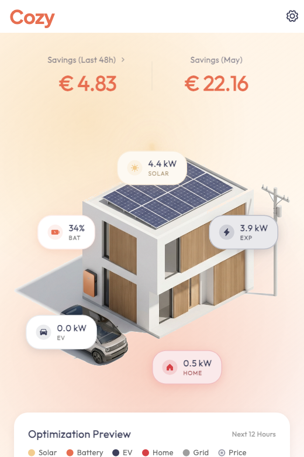
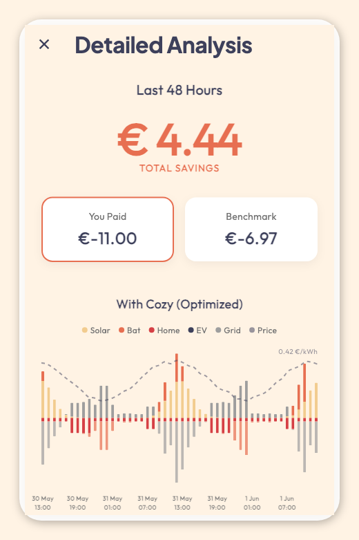
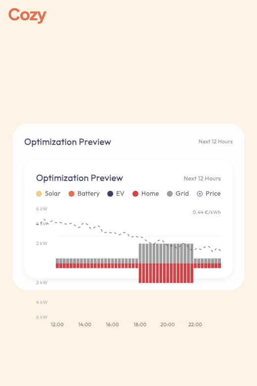
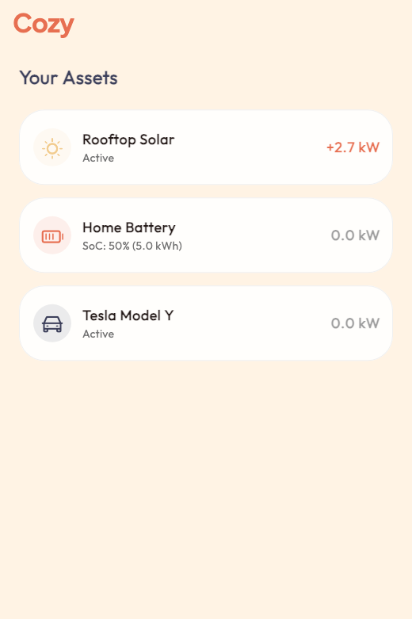

# Cozy 🏠⚡️

Cozy is a modern Home Energy Management System (HEMS) MVP designed to optimize energy usage, maximize savings, and provide a beautiful, real-time overview of your home's energy flow.

## ✨ Features

- **Real-Time Visualization**: Animated "Energy Flow" dashboard showing Solar, Grid, Battery, Home Load, and EV activity.
- **AI Optimization**: Uses linear programming (`ortools`) to schedule battery charging/discharging based on dynamic electricity prices (Day-Ahead Market).
- **Realistic Simulation**: Simulates home load profiles with morning and evening peaks.
- **Financial Tracking**: Tracks real-time savings compared to a "dumb" benchmark (no battery/smart control).
- **Asset Management**: Supports PV (Solar), Battery, and EV assets.

## 🛠 Tech Stack

- **Frontend**: [Flutter](https://flutter.dev) (Web & Mobile)
- **Backend**: [FastAPI](https://fastapi.tiangolo.com/) (Python)
- **Database**: [TimescaleDB](https://www.timescale.com/) (PostgreSQL extension for time-series)
- **Optimization**: Google OR-Tools
- **Forecasting**: NeuralForecast (TiDE/N-BEATS)

## 🧠 AI Optimization Engine

Cozy uses a sophisticated linear programming model to make intelligent energy decisions.

### How it works
The system solves for the **optimal battery schedule** (charge/discharge) for the next 24 hours to minimize total cost.

**Inputs:**
1.  **Day-Ahead Prices**: Fetched dynamically (simulated for MVP) to know when energy is cheap or expensive.
2.  **Load & Solar Forecasts**:
    *   Powered by **NeuralForecast** (using architectures like **TiDE** or **N-BEATS**).
    *   Analyzes historical consumption/generation data to predict the next 24 hours.
    *   Accounts for behavioral patterns (e.g., morning coffee spikes, evening TV) and weather dependency.

**Decision Variables:**
- `battery_charge[t]` / `battery_discharge[t]`: Optimal battery strategy.
- `ev_charge[t]`: Optimal Electric Vehicle charging schedule.
- `grid_import[t]` / `grid_export[t]`: Net grid interaction.

**Constraints:**
- Battery cannot charge and discharge simultaneously.
- State of Charge (SoC) for both Battery and EV must stay within limits.
- **EV Constraint**: Must be charged to target level (e.g., 80%) by departure time (e.g., 07:00 AM).
- Energy Balance: `Load + EV_Charge = Solar + Grid + Bat_Discharge - Bat_Charge`.

**Objective:**
$$ \text{Minimize} \sum_{t=0}^{24h} (\text{GridImport}_t \times \text{Price}_t - \text{GridExport}_t \times \text{FeedInTariff}) $$

This ensures the **Battery** charges when prices are low and discharges when high, while the **EV** intelligently schedules its charging session during the cheapest windows (e.g., late night or peak solar) without compromising departure readiness.

## 🚀 Getting Started

### Prerequisites
- Python 3.9+
- Docker & Docker Compose
- Flutter SDK

### 1. Backend Setup

The backend handles data simulation, optimization, and API serving.

```bash
# 1. Start Database
docker-compose up -d

# 2. Create Virtual Environment
python3 -m venv .venv
source .venv/bin/activate

# 3. Install Dependencies
pip install fastapi uvicorn sqlalchemy psycopg2-binary sqlmodel pandas numpy ortools

# 4. Initialize & Seed Data
python backend/init_db.py       # Create tables
python backend/clean_and_seed.py # Seed current month's data
python backfill_history.py      # Generate optimized history for the last 14 days

# 5. Run Server
uvicorn backend.main:app --reload --host 0.0.0.0 --port 8000
```

The API will be available at `http://localhost:8000`.

### 2. Frontend Setup

The frontend is a Flutter app.

```bash
cd app

# 1. Install Dependencies
flutter pub get

# 2. Run in Chrome (Recommended for MVP)
flutter run -d chrome
```

## 📸 Screenshots

| Dashboard | Savings (Real-time) |
|:---:|:---:|
|  |  |
| **Optimization Engine** | **Asset Monitor** |
|  |  |


